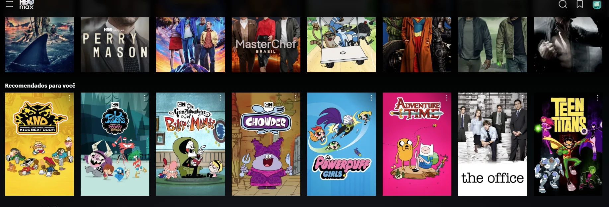
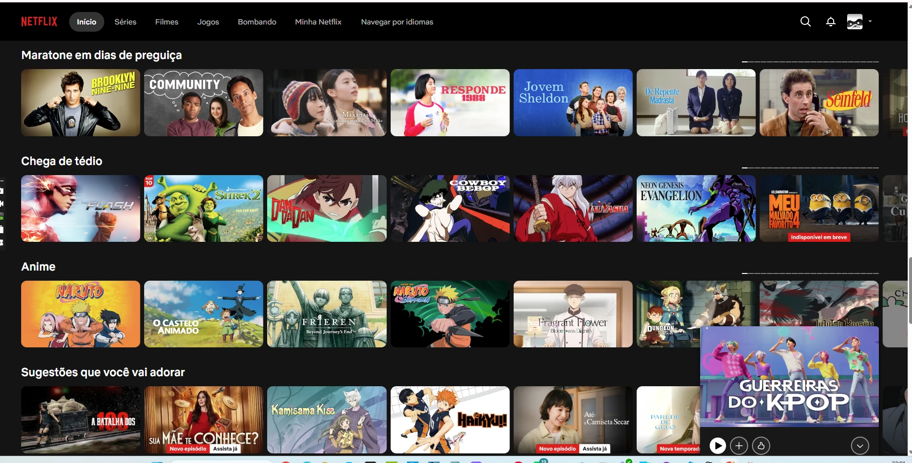
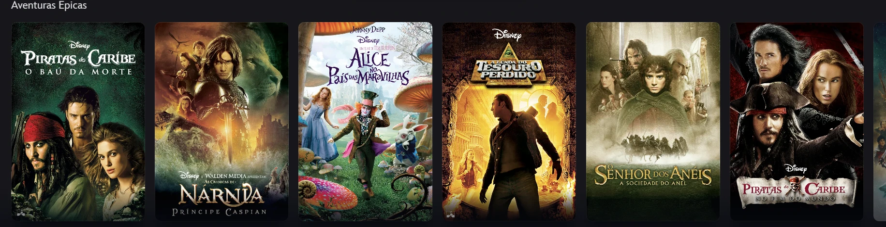

# References — Surf Time

## 1. Objetivo

As referências abaixo orientam as decisões de experiência e interface do Surf Time, com foco na necessidade escolhida: **descoberta de filmes por gênero**.

## 2. Referência 01 — HBO Max (Home com fileiras por categoria)

### Fonte
HBO Max — tela inicial (print do grupo)

### Imagem

### O que observamos?
A Home do HBO Max organiza o catálogo em fileiras horizontais de pôsteres, cada uma com um título de seção (ex: "Recomendados para você"). A barra superior fica fixa, com logo à esquerda e ícones de busca/perfil à direita, sobre um fundo escuro que faz os pôsteres coloridos se destacarem.

### O que vamos aproveitar?
A estrutura de fileiras horizontais roláveis como o principal padrão de navegação da Home — em vez de uma lista/grade única, o usuário vê vários gêneros ao mesmo tempo, cada um com sua própria fileira de pôsteres.

### Como será adaptado?
A Home do Surf Time passa a exibir uma fileira por gênero em destaque (ex: Ação, Comédia, Terror, Romance), cada uma buscada na API do TMDB (`discover/movie` filtrado por `with_genres`). O tema escuro e a barra superior fixa do `Header` seguem a mesma lógica visual (fundo escuro, marca à esquerda).

## 3. Referência 02 — Netflix (fileiras nomeadas por gênero/humor)

### Fonte
Netflix — tela inicial (print do grupo)

### Imagem

### O que observamos?
A Netflix nomeia cada fileira de forma bem específica por gênero ou humor ("Chega de tédio", "Anime", "Maratone em dias de preguiça"), o que ajuda o usuário a entender rapidamente o que vai encontrar em cada fileira sem precisar clicar em nada.

### O que vamos aproveitar?
A ideia de que o título da fileira comunica sozinho o "porquê" daquele agrupamento de filmes, e que cada fileira tem uma ação clara de "ver mais" daquele assunto específico.

### Como será adaptado?
No Surf Time, o título de cada `GenreRow` é o próprio nome do gênero vindo do TMDB (ex: "Comédia", "Terror"), com um link "Ver tudo" ao lado que leva para `/genero/:id` — a página com a grade completa daquele gênero, reaproveitando a mesma ideia de "expandir uma fileira em uma página dedicada".

## 4. Referência 03 — Disney+ (fileira temática "Aventuras Épicas")

### Fonte
Disney+ — tela inicial (print do grupo)

### Imagem

### O que observamos?
O Disney+ também usa fileiras horizontais, mas com um acabamento mais refinado: os pôsteres têm cantos arredondados e uma leve borda/sombra que os destaca do fundo escuro (em vez de ficarem "colados" um no outro), e o título da fileira ("Aventuras Épicas") aparece em texto fino e discreto, sem competir visualmente com os pôsteres.

### O que vamos aproveitar?
O acabamento mais "premium" dos cards (cantos arredondados + sombra sutil) e a hierarquia onde o título da fileira é discreto — o pôster é sempre o protagonista visual.

### Como será adaptado?
No `MovieCard`, foi adicionada uma borda sutil e uma sombra ao redor do pôster para destacá-lo do fundo escuro, e o título de cada `GenreRow` (`<h2>`) usa peso de fonte mais leve, mantendo o nome do gênero legível sem disputar atenção com os pôsteres.
